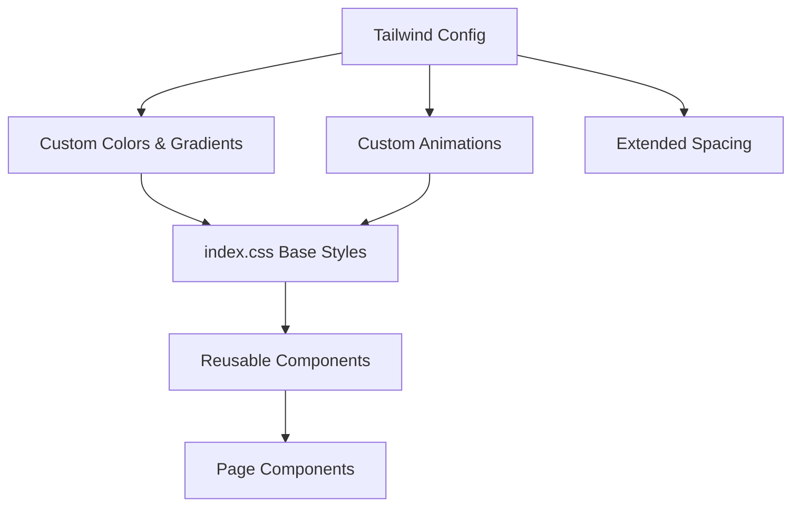

# UI Modernization Design Document

## Overview

This design document outlines the approach for modernizing the CopyBot dashboard's visual design. The current implementation uses basic Tailwind CSS with a dark gray theme. The modernization will introduce a cohesive design system with gradient accents, improved typography, refined components, and subtle animations while maintaining the existing React/Tailwind architecture.

## Architecture

The modernization follows a layered approach:

1. **Design Tokens Layer** - Extended Tailwind configuration with custom colors, gradients, and animations
2. **Base Styles Layer** - Global CSS with custom properties and utility classes
3. **Component Layer** - Reusable styled components (Card, Button, Input, Badge)
4. **Page Layer** - Updated page components using the new design system



## Components and Interfaces

### Design Tokens (tailwind.config.js)

```javascript
// Color palette
colors: {
  primary: {
    50: '#eef2ff',
    100: '#e0e7ff',
    // ... blue-purple gradient base
    500: '#6366f1',
    600: '#4f46e5',
    700: '#4338ca',
  },
  surface: {
    50: '#f8fafc',
    100: '#f1f5f9',
    // ... refined grays with blue undertone
    800: '#1e293b',
    900: '#0f172a',
    950: '#020617',
  }
}

// Gradients (via CSS custom properties)
--gradient-primary: linear-gradient(135deg, #6366f1 0%, #8b5cf6 50%, #a855f7 100%);
--gradient-accent: linear-gradient(135deg, #3b82f6 0%, #6366f1 100%);
--gradient-success: linear-gradient(135deg, #10b981 0%, #34d399 100%);
--gradient-danger: linear-gradient(135deg, #ef4444 0%, #f87171 100%);
```

### Base Component Styles

#### Card Component
- Background: `bg-surface-800/50` with `backdrop-blur-sm`
- Border: `border border-surface-700/50`
- Border radius: `rounded-xl`
- Hover: `hover:border-primary-500/30 hover:shadow-lg hover:shadow-primary-500/5`
- Transition: `transition-all duration-200`

#### Button Component (Primary)
- Background: `bg-gradient-to-r from-primary-500 to-purple-500`
- Hover: `hover:from-primary-600 hover:to-purple-600`
- Shadow: `shadow-lg shadow-primary-500/25`
- Padding: `px-6 py-2.5`
- Border radius: `rounded-lg`

#### Button Component (Secondary)
- Background: `bg-surface-800`
- Border: `border border-surface-600`
- Hover: `hover:bg-surface-700 hover:border-surface-500`

#### Input Component
- Background: `bg-surface-900/50`
- Border: `border border-surface-600`
- Focus: `focus:border-primary-500 focus:ring-2 focus:ring-primary-500/20`
- Border radius: `rounded-lg`

#### Badge Component
- Success: `bg-emerald-500/10 text-emerald-400 border border-emerald-500/20`
- Danger: `bg-red-500/10 text-red-400 border border-red-500/20`
- Warning: `bg-amber-500/10 text-amber-400 border border-amber-500/20`
- Neutral: `bg-surface-700 text-surface-300`

### Navigation Sidebar

```jsx
// Active state indicator
<div className="absolute left-0 top-0 bottom-0 w-1 bg-gradient-to-b from-primary-500 to-purple-500 rounded-r" />

// Nav item styling
className={`
  relative flex items-center gap-3 px-4 py-3 rounded-lg
  transition-all duration-200
  ${isActive 
    ? 'bg-primary-500/10 text-white' 
    : 'text-surface-400 hover:bg-surface-800 hover:text-white'}
`}
```

### Stat Card Component

```jsx
// Gradient accent border
<div className="relative bg-surface-800/50 rounded-xl p-6 border border-surface-700/50
  before:absolute before:inset-0 before:rounded-xl before:p-[1px] 
  before:bg-gradient-to-r before:from-primary-500/20 before:to-purple-500/20 before:-z-10">
  <div className="text-3xl font-bold bg-gradient-to-r from-white to-surface-300 bg-clip-text text-transparent">
    {value}
  </div>
  <div className="text-surface-400 text-sm mt-1">{label}</div>
</div>
```

## Data Models

No data model changes required. This is a purely frontend visual update.

## Correctness Properties

*A property is a characteristic or behavior that should hold true across all valid executions of a system-essentially, a formal statement about what the system should do. Properties serve as the bridge between human-readable specifications and machine-verifiable correctness guarantees.*

Most UI modernization requirements are visual/design requirements that cannot be verified through automated property-based testing. However, one functional property can be validated:

### Property 1: P&L Color Coding Consistency

*For any* P&L numeric value displayed in the dashboard, if the value is greater than or equal to zero, the element SHALL have green color styling applied; if the value is less than zero, the element SHALL have red color styling applied.

**Validates: Requirements 7.2**

## Error Handling

- **Font Loading Failure**: System falls back to `-apple-system, BlinkMacSystemFont, 'Segoe UI', sans-serif`
- **Gradient Not Supported**: Solid color fallbacks defined for all gradient properties
- **Animation Preference**: Respects `prefers-reduced-motion` media query by disabling animations

```css
@media (prefers-reduced-motion: reduce) {
  *, *::before, *::after {
    animation-duration: 0.01ms !important;
    transition-duration: 0.01ms !important;
  }
}
```

## Testing Strategy

### Unit Testing

Given the visual nature of this feature, unit tests will focus on:
- Component rendering without errors
- Conditional class application (e.g., P&L color logic)
- Loading state indicators appearing correctly

### Property-Based Testing

Property-based testing will be implemented using **fast-check** library for the P&L color coding property:

```javascript
// **Feature: ui-modernization, Property 1: P&L Color Coding Consistency**
// **Validates: Requirements 7.2**
fc.assert(
  fc.property(fc.float(), (pnlValue) => {
    const colorClass = getPnlColorClass(pnlValue);
    if (pnlValue >= 0) {
      return colorClass.includes('green') || colorClass.includes('emerald');
    } else {
      return colorClass.includes('red');
    }
  }),
  { numRuns: 100 }
);
```

### Visual Testing Approach

For comprehensive visual validation:
- Manual review of all pages against design specifications
- Browser testing across Chrome, Firefox, Safari
- Responsive testing at mobile, tablet, and desktop breakpoints
